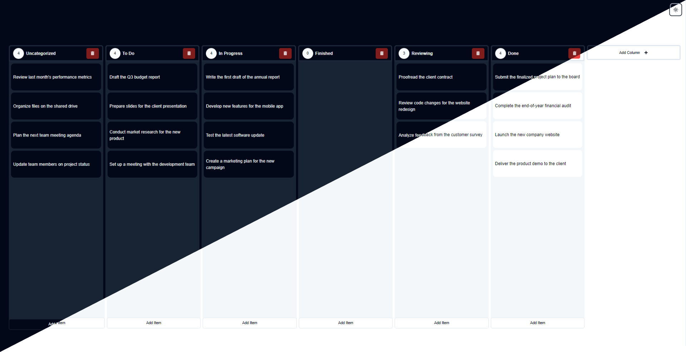

# React Kanban Board



## Overview : preview=> [kanban-board.kariuki.dev](https://kanban-board.stanleykariuki.online/)

React Kanban Board is a modern and intuitive Kanban board application built with React. It features a drag-and-drop interface, dark and light mode support, and persistent data storage, making it perfect for project management and task tracking.

## Features

- **Drag-and-Drop Interface:** Easily move tasks between columns using a seamless drag-and-drop experience.
- **Shadcn UI Components:** Utilizes Shadcn UI components for a sleek and professional user interface.
- **TailwindCSS Integration:** Styled with TailwindCSS for rapid UI development and customization.
- **Dark and Light Mode:** Toggle between dark and light themes to suit your preference.
- **Persistent Data:** Your data is stored in local storage, ensuring it remains intact even after page reloads.

## Getting Started

### Prerequisites

- **Node.js:** Make sure you have Node.js installed. You can download it from [Node.js](https://nodejs.org/).
- **npm or Yarn:** Use npm (comes with Node.js) or Yarn as your package manager.

### Installation

1. **Clone the repository:**
    ```bash
    git clone https://github.com/leestan306/react-kanban-board.git
    cd react-kanban-board
    ```

2. **Install dependencies:**
    ```bash
    npm install
    # or
    yarn install
    ```

3. **Start the development server:**
    ```bash
    npm start
    # or
    yarn start
    ```

4. **Build for production:**
    ```bash
    npm run build
    # or
    yarn build
    ```

### Usage

- **Add New Columns:** Click the "Add Column" button to create a new column.
- **Add Tasks:** Use the column's "Add Task" button to create tasks within any column.
- **Edit and Delete:** Edit task content or delete tasks and columns as needed.
- **Drag and Drop:** Reorganize tasks and columns using the drag-and-drop interface.
- **Toggle Theme:** Switch between dark and light modes for better visual comfort.

## Technologies Used

- **React:** JavaScript library for building user interfaces.
- **Shadcn UI Components:** Custom UI components for a modern look and feel.
- **TailwindCSS:** Utility-first CSS framework for rapid UI development.
- **@dnd-kit/core:** Drag-and-drop toolkit for React.
- **Local Storage:** Browser-based storage for persisting data.

## Preview


## Contributing

Contributions are welcome! Please feel free to submit a Pull Request.

## License


